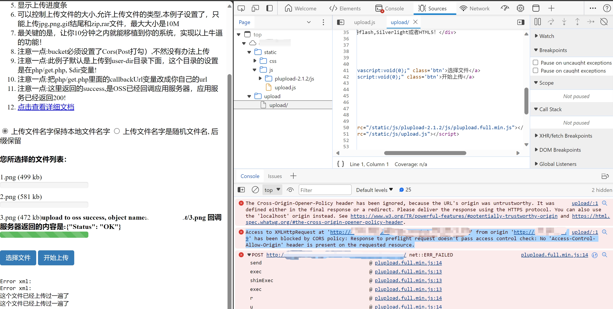

## aliyun oss service with callback appserver
[aliyun official link](https://help.aliyun.com/zh/oss/use-cases/overview-20?spm=a2c4g.11186623.0.0.65753e42VKCC7k) 
Since i encoutered endless error when using the official link and cannot get accurate answer from the client-service, i design this demo repo for web newbies like me to implenment this.


My appserver use framework as django+uwsgi+nginx 
### Install
``` bash
# 1. install miniconda3 (recommend) or venv on your server machine 
# 2. create a python3.8 env and activate it
pip install -U pip
pip install Django pycryptodome PyYAML
sudo apt-get install python3.8-dev
sudo apt-get install gcc
# 3. uwsgi wheel build seems not support for current version and install wheel does not solve it, thus i use conda channel
conda install uwsgi
# 4. install nginx 
sudo apt-get install nginx
# 5. start django project and application (not need if you clone this repo)
django-admin.py startproject oss_upload_app
cd oss_upload_app
python manage.py startapp upload
```

### modify your files in django app folder
- 1. `appfunc.py` in app folder
- 2. use `config.yaml` to store your access key id and other stuff. (Be aware of the explicit information risk! I just use this as demo)
- 3. change `views.py` in app folder
- 4. add `xxx.ini` used by uwsgi (`oss_upload_app_uwsgi.ini` in this repo)
- 5. check about the `static` and `templates` sub-folder in app folder

### modify your files in django <project>/<project> folder
```python
# settings.py
# ...
ALLOWED_HOSTS = ['kk.xxx.bb.cc']

INSTALLED_APPS = [
    # others
    'upload',
]

# ...

TEMPLATES = [
    {
        # ...
        'APP_DIRS': True,
        # ...
    },
]
# ...
STATIC_URL = '/static/'
MEDIA_URL = '/media/'
STATIC_ROOT = os.path.join(BASE_DIR, "static/")
MEDIA_ROOT = os.path.join(BASE_DIR, 'media/')

# ...
```

``` python
# urls.py
# ...
from upload.views import AppServerView, upload_page

urlpatterns = [
    path('upload/', upload_page, name='upload_page'),
    path('', AppServerView.as_view(), name='app_server'),
]
# ...
```
### modify nginx configuration file
``` conf
# the upstream component nginx needs to connect to
upstream django {
    server unix:///home/user/oss_upload_app/oss_upload_app.sock;
}
# configuration of the server
server {
    listen      80;
    server_name kk.xxx.bb.cc;
    charset     utf-8;
    # max upload size
    client_max_body_size 75M;
    # Django media and static files
    location /media  {
        alias /home/user/oss_upload_app/media;
    }
    location /static {
        alias /home/user/oss_upload_app/static;
    }
    # Send all non-media requests to the Django server.
    location / {
        uwsgi_pass  django;
        include     /home/user/oss_upload_app/uwsgi_params;
    }
}
server {
    listen      8080;
    location / {
        uwsgi_pass django;
        include    /home/user/oss_upload_app/uwsgi_params;
    }
}
```
### Deploy the appserver

```bash
# 1. link the nginx configuration to enabled
sudo ln -s /etc/nginx/sites-available/xxx.conf /etc/nginx/sites-enabled/ 
# 2. collect static in django project
python manage.py collectstatic
sudo /etc/init.d/nginx restart
sudo ln -s /home/user/oss_upload_app/oss_upload_app_uwsgi.ini /home/user/miniconda3/envs/oss_app/vassals/
# 3. start with uwsgi emperor
uwsgi --emperor /home/user/miniconda3/envs/oss_app/vassals/
```
now you can visit http://kk.xxx.bb.cc/upload and try to upload to oss 
when get following screenshot means you succeed.


